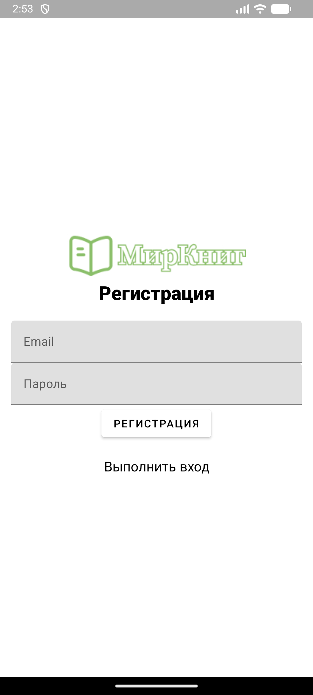
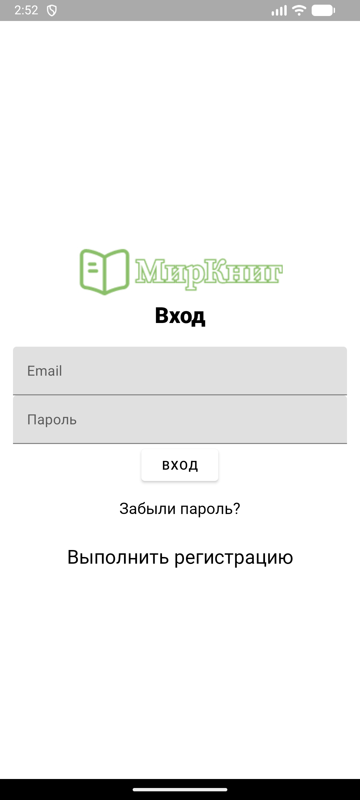
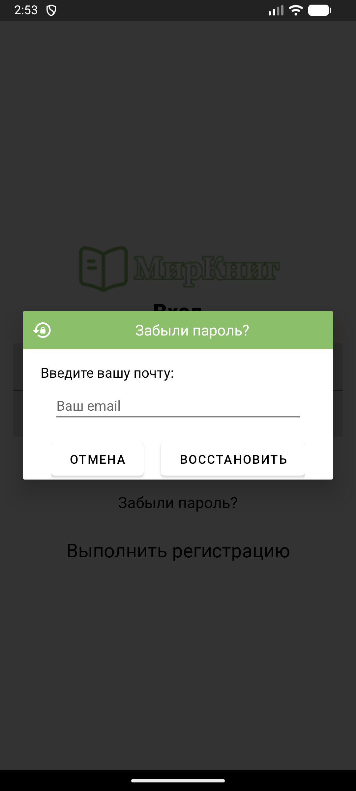
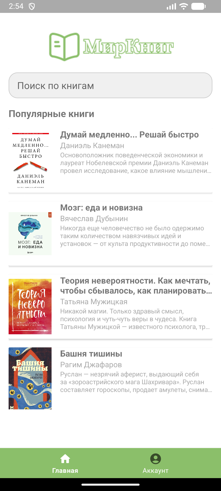
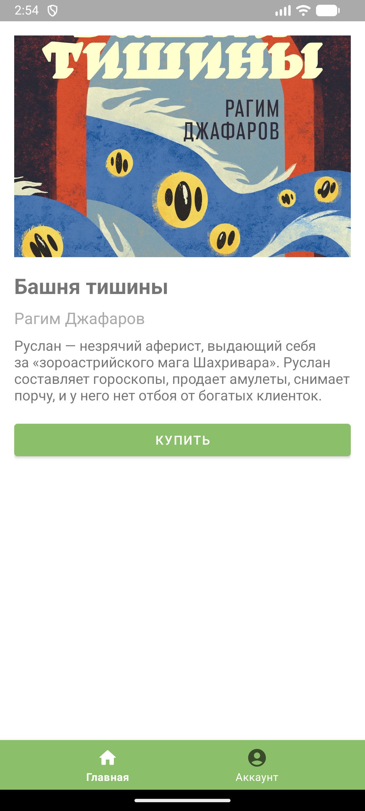
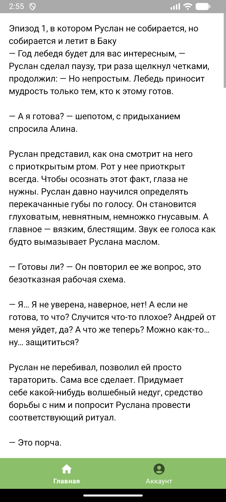

# 📚 LibraryApp

Android-приложение для чтения и управления личной библиотекой. Просматривай книги, читай их онлайн и
управляй аккаунтом — всё с учётной записью Firebase!

---

## 🌟 Функционал

- 🔐 **Авторизация через Firebase Auth** (email + пароль)
- 📖 **Каталог книг** из `assets/books.json`
- 🔍 **Поиск** по названию, автору или описанию
- 📘 **Просмотр подробной информации о книге**
- 📖 **Встроенный просмотрщик текста книги** (`BookReaderFragment`)
- 👤 **Личный кабинет** с email и кнопкой выхода
- 🔄 **Автоматический переход в `MainActivity`** при наличии активной сессии

---

## 🛠 Используемые технологии

- **Язык**: Java (Android)
- **Архитектура**: Activity + Fragment + Bottom Navigation
- **UI**: Material Design, ViewBinding (`ActivityMainBinding`)
- **Аутентификация**: Firebase Authentication
- **Хранение данных**: JSON-файлы в `assets/` (статический каталог книг)
- **Библиотеки**:
    - `com.google.firebase:firebase-auth`
    - `com.google.code.gson:gson`
    - `androidx.recyclerview:recyclerview`

---

## 🗂 Структура проекта

```
com.library.libraryapp/
├── SplashActivity.java        → Заставка + проверка авторизации
├── LoginActivity.java         → Вход и восстановление пароля
├── RegisterActivity.java      → Регистрация (реализована, но код не показан)
├── MainActivity.java          → Основной экран с BottomNavigationView
├── HomeFragment.java          → Список книг + поиск
├── BookDetailsFragment.java   → Детали книги + кнопка "Читать"
├── BookReaderFragment.java    → Просмотр полного текста книги
├── AccountFragment.java       → Email пользователя + выход
├── BookAdapter.java           → Адаптер для RecyclerView
└── Book.java                  → Модель книги
```

> 📁 Книги описываются в `assets/books.json` и загружаются через **Gson**.  
> 🖼 Обложки — ресурсы из `res/drawable`, имена задаются в JSON.

---

## 📦 Формат `books.json`

Пример структуры (в твоём `assets/books.json`):

```json
{
  "books": [
    {
      "title": "Война и мир",
      "author": "Лев Толстой",
      "description": "Эпопея о жизни русского общества...",
      "imageResourceName": "war_and_peace",
      "content": "Полный текст книги..."
    }
  ]
}
```

## 📸 Скриншоты

| Страница регистрации | Страница авторизации | Модальное окно для восстановления пароля | Главный экран | Детали книги | Чтение книги |
|:--------------------:|:--------------------:|:----------------------------------------:|:-------------:|:------------:|:------------:|
|  |  |  |  |  |  |
